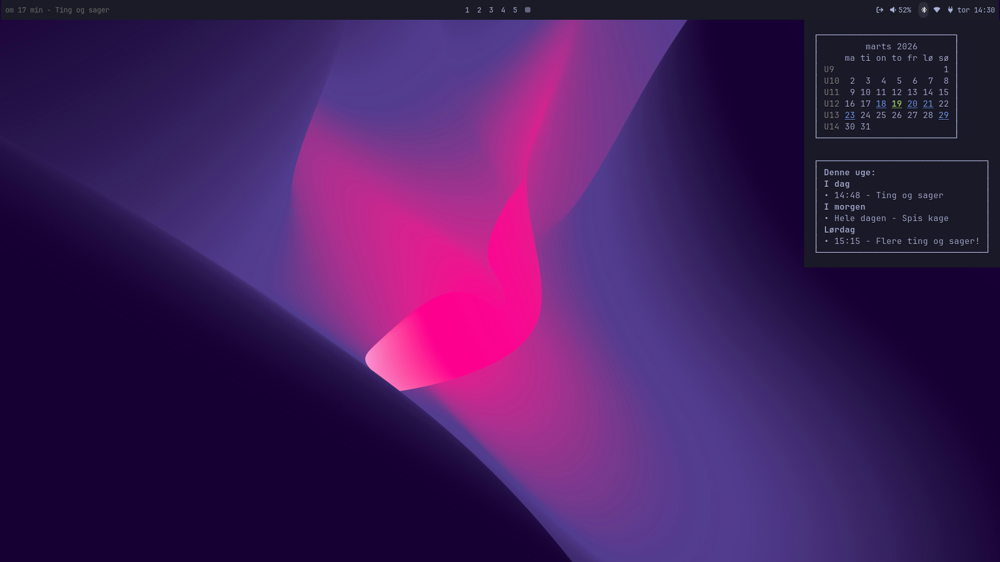
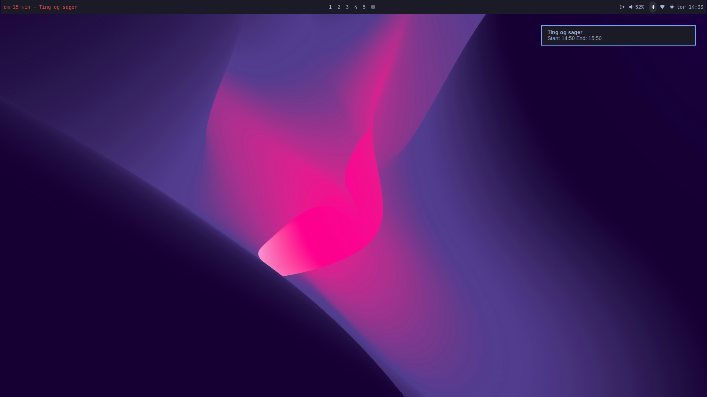

# waybar-meeting-calendar

Two [Waybar](https://github.com/Alexays/Waybar) modules for [Omarchy](https://omarchy.org) that integrate Google Calendar into your bar — a next-meeting ticker and a scrollable calendar tooltip with a weekly agenda.

> Designed for Omarchy. Should work on any Waybar setup with minor adjustments to paths and CSS.

---

## Screenshots

**Calendar tooltip:**



**Meeting notification and nextmeeting corner ticker:**



---

## Features

### `custom/agenda` — Next meeting ticker

- Shows the next meeting of the day in the bar: `om 12 min - Standup`
- Updates every 59 seconds
- Turns red when a meeting is imminent (configurable threshold, default 15 min)
- **Click** — opens the meeting URL (Google Meet, Zoom, etc.) directly
- Hidden when there are no more meetings today

### `custom/clock` — Clock with calendar tooltip

- Shows the current time in Danish short format (`tor 14:32`)
- **Hover** — reveals a tooltip with two panels:
  - A full month calendar with ISO week numbers (`U12`), today highlighted in green, and days with appointments underlined in blue
  - A "Denne uge" box listing all timed and all-day events for the current Mon–Sun week
- **Scroll up/down** — navigates forward/backward through months; the calendar and appointment markers update as you scroll
- **Middle-click** — snaps back to the current month and forces a fresh cache fetch from Google Calendar
- **Click** — opens Google Calendar in the browser
- **Right-click** — opens the timezone selector (`omarchy-tz-select`)

### Caching

Events are fetched via `gcalcli` for the entire calendar year at once and cached in `~/.cache/clock-waybar/events-YYYY.tsv`. The cache is refreshed every 5 minutes automatically, so scrolling through months is instant after the first load. Middle-clicking forces an immediate refresh.

---

## Prerequisites

- [Omarchy](https://omarchy.org) (or a compatible Waybar setup)
- [gcalcli](https://github.com/insanum/gcalcli) — authenticated with your Google account
- [nextmeeting](https://github.com/chmouel/nextmeeting) — `pip install nextmeeting`
- Python 3.6+
- `da_DK.UTF-8` locale installed (for Danish day/month names and calendar formatting)

### Install gcalcli and authenticate

```bash
pip install gcalcli
gcalcli init   # follow the OAuth flow to connect your Google account
gcalcli agenda # verify it works
```

### Install nextmeeting

```bash
pip install nextmeeting
nextmeeting    # verify it can see your calendar
```

### Verify Danish locale

```bash
locale -a | grep da_DK
```

If missing:

```bash
sudo locale-gen da_DK.UTF-8
```

---

## Installation

### 1. Clone into the Waybar scripts directory

```bash
git clone https://github.com/m-kudahl/waybar-meeting-calendar \
    ~/.config/waybar/scripts/waybar-meeting-calendar
chmod +x ~/.config/waybar/scripts/waybar-meeting-calendar/*
```

### 2. Add modules to `~/.config/waybar/config.jsonc`

Add `"custom/agenda"` to `modules-left` and `"custom/clock"` to `modules-right`, replacing the default Waybar clock if present:

```jsonc
"modules-left": [
  "custom/agenda",
  "hyprland/window",
],

"modules-right": [
  // ... your other modules ...
  "custom/clock",
],
```

Then add the module definitions:

```jsonc
"custom/agenda": {
  "format": "{}",
  "exec": "~/.config/waybar/scripts/waybar-meeting-calendar/nextmeeting-waybar",
  "on-click": "nextmeeting --open-meet-url",
  "interval": 59,
  "return-type": "json",
  "tooltip": "true",
},

"custom/clock": {
  "exec": "~/.config/waybar/scripts/waybar-meeting-calendar/clock-waybar",
  "interval": 60,
  "return-type": "json",
  "on-click": "xdg-open 'https://calendar.google.com'",
  "on-scroll-up": "~/.config/waybar/scripts/waybar-meeting-calendar/clock-waybar-scroll up",
  "on-scroll-down": "~/.config/waybar/scripts/waybar-meeting-calendar/clock-waybar-scroll down",
  "on-click-middle": "~/.config/waybar/scripts/waybar-meeting-calendar/clock-waybar-refresh",
  "on-click-right": "omarchy-launch-floating-terminal-with-presentation omarchy-tz-select",
  "signal": 11,
},
```

> If you are not on Omarchy, you can replace `omarchy-launch-floating-terminal-with-presentation omarchy-tz-select` with something else.

### 3. Add CSS to `~/.config/waybar/style.css`

```css
#custom-agenda {
  color: #696969;
}

#custom-agenda.soon {
  color: #eb4d4b;
}

tooltip {
  padding: 2px;
}

tooltip label {
  font-size: 16px;
}
```

### 4. Reload Waybar

```bash
pkill waybar && waybar &
```

---

## File overview

```
waybar-meeting-calendar/
├── nextmeeting-waybar       # Python — agenda bar module (runs every 59s)
├── clock-waybar             # Bash  — clock module entry point (runs every 60s)
├── clock-waybar-render.py   # Python — renders the calendar and meetings tooltip
├── clock-waybar-scroll      # Bash  — handles scroll up/down to change month
├── clock-waybar-refresh     # Bash  — handles middle-click to force cache refresh
└── fetch-year-cache         # Bash  — fetches/caches a full year of gcalcli events
```

---

## Configuration

### Change the meeting notification threshold

In `nextmeeting-waybar`, adjust `--notify-min-before-events` (default: `15` minutes):

```python
"--notify-min-before-events", "15",
```

### Change the cache TTL

In `fetch-year-cache`, the default TTL is 300 seconds (5 minutes). Pass a different value when calling it, or edit the default in the script:

```bash
ttl=${2:-300}
```

### Use a different language

Danish day/month names are hardcoded in `clock-waybar-render.py`. Replace the `danish_days` and `danish_months` lists with your language, and change the `LC_TIME=da_DK.UTF-8` references in `clock-waybar` to match your locale.
